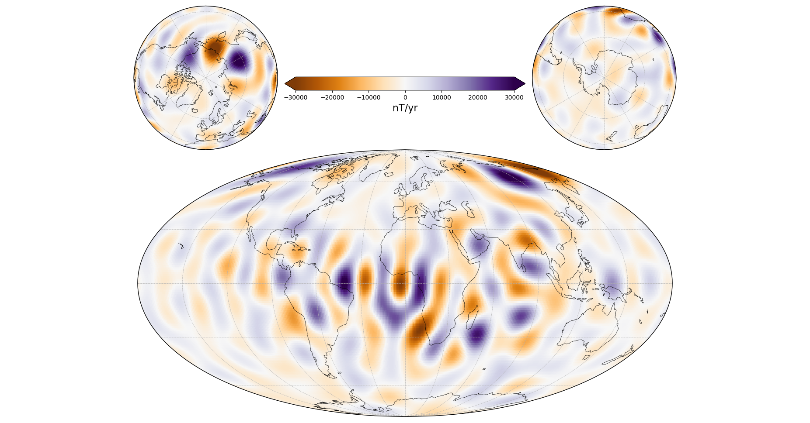

Usage
=====

Here are some simple examples on how to use the package. This only requires a
CHAOS model mat-file, e.g. "CHAOS-6-x7.mat" in the current working directory.
The model coefficients can be downloaded `here <http://www.spacecenter.dk/files/magnetic-models/CHAOS-7/>`_.

Computing the field components on a grid
----------------------------------------

Use ChaosMagPy to compute the magnetic field components of the different
sources that are accounted for in the model. For example, the time-dependent
internal field:

.. code-block:: python

   import numpy as np
   import chaosmagpy as cp

   # create full grid
   radius = 3485.  # km, core-mantle boundary
   theta = np.linspace(0., 180., num=181)  # colatitude in degrees
   phi = np.linspace(-180., 180., num=361)  # longitude in degrees

   phi_grid, theta_grid = np.meshgrid(phi, theta)
   radius_grid = radius*np.ones(phi_grid.shape)

   time = cp.data_utils.mjd2000(2000, 1, 1)  # modified Julian date

   # load the CHAOS model
   model = cp.load_CHAOS_matfile('CHAOS-6-x7.mat')

   # compute field components on the grid using the Gauss coefficients
   B_radius, B_theta, B_phi = model.synth_values_tdep(coeffs, radius_grid, theta_grid, phi_grid)

When using a *regular* grid, consider ``grid=True`` option for
speed. It will internally compute a grid in ``theta`` and ``phi`` similar to
:func:`numpy.meshgrid` in the example above while saving time with some of the
computations (note the usage of, for example, ``theta`` instead of
``theta_grid``):

.. code-block:: python

   B_radius, B_theta, B_phi = model.synth_values_tdep(time, radius, theta, phi, grid=True)

The same computation can be done with other sources described by the model:

+----------+-----------------+---------------------------------------------------+
|  Source  |     Type        | Method in :class:`~.CHAOS` class                  |
+==========+=================+===================================================+
| internal | time-dependent  | :meth:`~.CHAOS.synth_values_tdep` (see example)   |
+          +-----------------+---------------------------------------------------+
|          | static          | :meth:`~.CHAOS.synth_values_static`               |
+----------+-----------------+---------------------------------------------------+
| external | time-dep. (GSM) | :meth:`~.CHAOS.synth_values_gsm`                  |
+          +-----------------+---------------------------------------------------+
|          | time-dep. (SM)  | :meth:`~.CHAOS.synth_values_sm`                   |
+----------+-----------------+---------------------------------------------------+

Computing a timeseries of Gauss coefficients
--------------------------------------------

ChaosMagPy can also be used to synthesize a timeseries of the spherical
harmonic coefficients first. For example, in the case of the time-dependent
internal field:

.. code-block:: python

   import numpy as np
   import chaosmagpy as cp

   # create vector of time instances in modified Julian date from 2000 to 2004
   time = np.linspace(0., 4*365.25, 10)  # 10 equally-spaced time instances

   # load the CHAOS model
   model = cp.load_CHAOS_matfile('CHAOS-6-x7.mat')

   # compute the Gauss coefficients of the internal field up to degree 14
   coeffs = model.synth_coeffs_tdep(time, nmax=14, deriv=0)  # shape: (10, 196)

The same can be done with other sources accounted for in CHAOS.

+----------+-----------------+---------------------------------------------------+
|  Source  |     Type        | Method in :class:`~.CHAOS` class                  |
+==========+=================+===================================================+
| internal | time-dependent  | :meth:`~.CHAOS.synth_coeffs_tdep` (see example)   |
+          +-----------------+---------------------------------------------------+
|          | static          | :meth:`~.CHAOS.synth_coeffs_static`               |
+----------+-----------------+---------------------------------------------------+
| external | time-dep. (GSM) | :meth:`~.CHAOS.synth_coeffs_gsm`                  |
+          +-----------------+---------------------------------------------------+
|          | time-dep. (SM)  | :meth:`~.CHAOS.synth_coeffs_sm`                   |
+----------+-----------------+---------------------------------------------------+

Converting time formats in ChaosMagPy
-------------------------------------

The models in ChaosMagPy are based on time in modified Julian date. But
sometimes it is easier to work in different units such as decimal years or
Numpy's datetime. For those cases, ChaosMagPy offers simple conversion
functions:

.. code-block:: python

   import chaosmagpy as cp

   mjd = 412.  # 2001-02-16

   dyear = cp.data_utils.mjd_to_dyear(mjd)  # to decimal years (accounts for leap years)
   # dyear = 2001.1260273972603

   timestamp = cp.data_utils.timestamp(mjd)  # to Numpy's datetime
   # timestamp = numpy.datetime64('2001-02-16T00:00:00.000000')

The inverse operations are also available:

.. code-block:: python

   cp.data_utils.dyear_to_mjd(dyear)  # from decimal years (accounts for leap years)
   # 412.0

   cp.data_utils.mjd2000(timestamp)  # from Numpy's datetime
   # 412.0

At the same time, :func:`chaosmagpy.data_utils.mjd2000` accepts a wide range of
inputs (see the documentation).

Computing a timeseries of field components at two ground observatories
----------------------------------------------------------------------

Compute the time series of the first time-derivative of the field components at
the ground observatories in Niemegk (Germany) and Mbour (Senegal).

.. code-block:: python

   from chaosmagpy import load_CHAOS_matfile
   from chaosmagpy.model_utils import synth_values
   from chaosmagpy.data_utils import mjd2000
   from chaosmagpy.plot_utils import plot_timeseries
   import matplotlib.pyplot as plt
   import numpy as np

   model = load_CHAOS_matfile('CHAOS-6-x7.mat')

   N = 500
   time = np.linspace(mjd2000(1998, 1, 1), mjd2000(2018, 1, 1), num=N)
   radius = 6371.2 * np.ones((2,))
   theta = np.array([75.62, 37.93])  # colatitude in degrees
   phi = np.array([343.03, 12.68])  # longitude in degrees

   stations = ['Mbour', 'Niemegk']  # ground observatory names

   # reshape to use NumPy broadcasting
   time = np.reshape(time, (1, N))  # 1 x N
   radius = np.reshape(radius, (2, 1))  # 2 x 1
   theta = np.reshape(theta, (2, 1))  # 2 x 1
   phi = np.reshape(phi, (2, 1))  # 2 x 1

   coeffs = model.synth_coeffs_tdep(time, nmax=16, deriv=1)

   # compute field components of shape 2 x N
   B_radius, B_theta, B_phi = synth_values(coeffs, radius, theta, phi)

   # plot time series of the stations
   for idx, station in enumerate(stations):
       titles = [' $dB_r/dt$ at ' + station,
                 ' $dB_\\theta/dt$ at ' + station,
                 ' $dB_\\phi/dt$ at ' + station]
       plot_timeseries(time, B_radius[idx], B_theta[idx], B_phi[idx],
                       ylabel='nT/yr', titles=titles)
   plt.show()

.. figure:: images/plot_timeseries.png
   :align: center

   Timeseries of the secular variation at two ground observatory stations.

Any timeseries can be generated this way.

Plotting a map of the time-dependent internal field
---------------------------------------------------

Here, we make a map of the first time-derivative of the time-dependent internal
part of the model. We will plot it on the surface at 3485 km (core-mantle
boundary) from the center of Earth and on January 1, 2000:

.. code-block:: python

   import chaosmagpy as cp

   model = cp.load_CHAOS_matfile('CHAOS-6-x7.mat')

   radius = 3485.0  # km, here core-mantle boundary
   time = 0.0  # mjd2000, here Jan 1, 2000 0:00 UTC

   model.plot_maps_tdep(time, radius, nmax=16, deriv=1)  # plots the SV up to degree 16

.. figure:: images/plot_maps_tdep.png
   :align: center

   Secular variation at the core-mantle-boundary up to degree 16 in
   January 1, 2000 0:00 UTC.

Save Gauss coefficients of the time-dependent internal (i.e. large-scale core)
field in shc-format to a file:

.. code-block:: python

   model.save_shcfile('CHAOS-6-x7_tdep.shc', model='tdep')

Plotting a map of the static internal field
-------------------------------------------

Similarly, the static internal (i.e. small-scale crustal) part of the model can
be plotted on a map:

.. code-block:: python

   import chaosmagpy as cp

   model = cp.load_CHAOS_matfile('CHAOS-6-x7.mat')
   model.plot_maps_static(radius=6371.2, nmax=85)

.. figure:: images/plot_maps_static.png
   :align: center

   Static internal small-scale field at Earth's surface up to degree 85.

and saved

.. code-block:: python

   model.save_shcfile('CHAOS-6-x7_static.shc', model='static')

Plotting a global map together with polar views
-----------------------------------------------

.. code-block:: python

   import chaosmagpy as cp
   import numpy as np
   import matplotlib.pyplot as plt
   import matplotlib.gridspec as gridspec
   from mpl_toolkits.axes_grid1.inset_locator import inset_axes
   import cartopy.crs as ccrs

   chaos = cp.CHAOS.from_mat('CHAOS-6-x9.mat')

   time = cp.data_utils.mjd2000(2016, 1, 1)
   radius = 3485.
   theta = np.linspace(1., 179., 181)
   phi = np.linspace(-180., 180, 361)
   B, _, _ = chaos.synth_values_tdep(time, radius, theta, phi,
                                     nmax=16, deriv=1, grid=True)

   limit = 30e3  # nT colorbar limit

   # create figure
   fig = plt.figure(figsize=(16, 10))

   # make array of axes
   gs = gridspec.GridSpec(2, 2, width_ratios=[0.5, 0.5], height_ratios=[0.35, 0.65])

   axes = []
   axes.append(plt.subplot(gs[0, 0], projection=ccrs.NearsidePerspective(central_latitude=90.)))
   axes.append(plt.subplot(gs[0, 1], projection=ccrs.NearsidePerspective(central_latitude=-90.)))
   axes.append(plt.subplot(gs[1, :], projection=ccrs.Mollweide()))

   for ax in axes:
       pc = ax.pcolormesh(phi, 90. - theta, B, cmap='PuOr', vmin=-limit,
                          vmax=limit, transform=ccrs.PlateCarree())
       ax.gridlines(linewidth=0.5, linestyle='dashed',
                    ylocs=np.linspace(-90, 90, num=7),  # parallels
                    xlocs=np.linspace(-180, 180, num=13))  # meridians
       ax.coastlines(linewidth=0.5)

   # inset axes into global map and move upwards
   cax = inset_axes(axes[-1], width="45%", height="5%", loc='upper center',
                    borderpad=-12)

   # use last artist for the colorbar
   clb = plt.colorbar(pc, cax=cax, extend='both', orientation='horizontal')
   clb.set_label('nT/yr', fontsize=16)

   plt.subplots_adjust(top=0.985, bottom=0.015, left=0.008,
                       right=0.992, hspace=0.0, wspace=0.0)

   plt.show()

  Model of the radial secular variation at the core surface in 2016.
