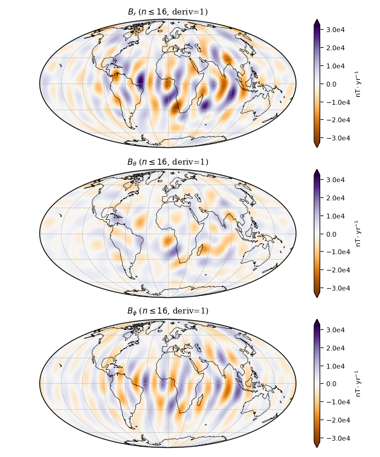
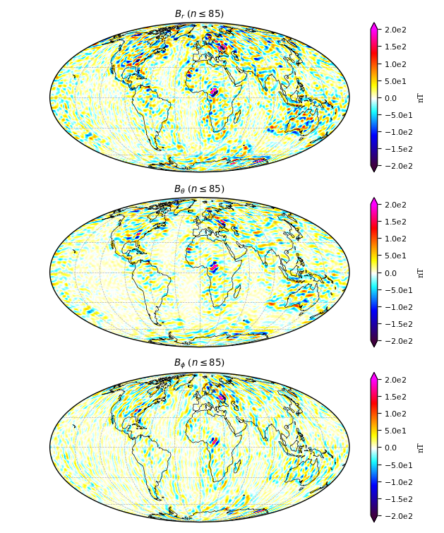

.. _sec-usage:

Usage
=====

Here are some simple examples on how to use the package. This only requires a
CHAOS model mat-file, e.g. "CHAOS-6-x7.mat" in the current working directory.
The model coefficients can be downloaded `here <http://www.spacecenter.dk/files/magnetic-models/CHAOS-7/>`_.

Computing the field components on a grid
----------------------------------------

Use ChaosMagPy to compute the magnetic field components of the different
sources that are accounted for in the model. For example, the time-dependent
internal field:

.. code-block:: python

   import numpy as np
   import chaosmagpy as cp

   # create full grid
   radius = 3485.  # km, core-mantle boundary
   theta = np.linspace(0., 180., num=181)  # colatitude in degrees
   phi = np.linspace(-180., 180., num=361)  # longitude in degrees

   phi_grid, theta_grid = np.meshgrid(phi, theta)
   radius_grid = radius*np.ones(phi_grid.shape)

   time = cp.data_utils.mjd2000(2000, 1, 1)  # modified Julian date

   # load the CHAOS model
   model = cp.load_CHAOS_matfile('CHAOS-6-x7.mat')

   # compute field components on the grid using the Gauss coefficients
   B_radius, B_theta, B_phi = model.synth_values_tdep(coeffs, radius_grid, theta_grid, phi_grid)

When using a *regular* grid, consider ``grid=True`` option for
speed. It will internally compute a grid in ``theta`` and ``phi`` similar to
:func:`numpy.meshgrid` in the example above while saving time with some of the
computations (note the usage of, for example, ``theta`` instead of
``theta_grid``):

.. code-block:: python

   B_radius, B_theta, B_phi = model.synth_values_tdep(time, radius, theta, phi, grid=True)

The same computation can be done with other sources described by the model:

+----------+-----------------+---------------------------------------------------+
|  Source  |     Type        | Method in :class:`~.CHAOS` class                  |
+==========+=================+===================================================+
| internal | time-dependent  | :meth:`~.CHAOS.synth_values_tdep` (see example)   |
+          +-----------------+---------------------------------------------------+
|          | static          | :meth:`~.CHAOS.synth_values_static`               |
+----------+-----------------+---------------------------------------------------+
| external | time-dep. (GSM) | :meth:`~.CHAOS.synth_values_gsm`                  |
+          +-----------------+---------------------------------------------------+
|          | time-dep. (SM)  | :meth:`~.CHAOS.synth_values_sm`                   |
+----------+-----------------+---------------------------------------------------+

Computing a time series of Gauss coefficients
---------------------------------------------

ChaosMagPy can also be used to synthesize a time series of the spherical
harmonic coefficients. For example, in the case of the time-dependent
internal field:

.. code-block:: python

   import numpy as np
   import chaosmagpy as cp

   # load the CHAOS model from the mat-file
   model = cp.load_CHAOS_matfile('CHAOS-6-x7.mat')

   print('Model timespan is:', model.model_tdep.breaks[[0, -1]])

   # create vector of time points in modified Julian date from 2000 to 2004
   time = np.linspace(0., 4*365.25, 10)  # 10 equally-spaced time instances

   # compute the Gauss coefficients of the MF, SV and SA of the internal field
   coeffs_MF = model.synth_coeffs_tdep(time, nmax=13, deriv=0)  # shape: (10, 195)
   coeffs_SV = model.synth_coeffs_tdep(time, nmax=14, deriv=1)  # shape: (10, 224)
   coeffs_SA = model.synth_coeffs_tdep(time, nmax=9, deriv=2)  # shape: (10, 99)

   # save time and coefficients to a txt-file: each column starts with the time
   # point in decimal years followed by the Gauss coefficients in
   # natural order, i.e. g(n,m): g(1,0), g(1, 1), h(1, 1), ...

   dyear = cp.data_utils.mjd_to_dyear(time)  # convert mjd2000 to decimal year

   np.savetxt('MF.txt', np.concatenate([dyear[None, :], coeffs_MF.T]), fmt='%10.5f', delimiter=' ')
   np.savetxt('SV.txt', np.concatenate([dyear[None, :], coeffs_SV.T]), fmt='%10.5f', delimiter=' ')
   np.savetxt('SA.txt', np.concatenate([dyear[None, :], coeffs_SA.T]), fmt='%10.5f', delimiter=' ')

The same can be done with other sources accounted for in CHAOS. However, except
for the time-dependent internal field, there are no time derivatives available.

+----------+-----------------+---------------------------------------------------+
|  Source  |     Type        | Method in :class:`~.CHAOS` class                  |
+==========+=================+===================================================+
| internal | time-dependent  | :meth:`~.CHAOS.synth_coeffs_tdep` (see example)   |
+          +-----------------+---------------------------------------------------+
|          | static          | :meth:`~.CHAOS.synth_coeffs_static`               |
+----------+-----------------+---------------------------------------------------+
| external | time-dep. (GSM) | :meth:`~.CHAOS.synth_coeffs_gsm`                  |
+          +-----------------+---------------------------------------------------+
|          | time-dep. (SM)  | :meth:`~.CHAOS.synth_coeffs_sm`                   |
+----------+-----------------+---------------------------------------------------+

Converting time formats in ChaosMagPy
-------------------------------------

The models in ChaosMagPy only accept modified Julian date. But
sometimes it is easier to work in different units such as decimal years or
Numpy's datetime. For those cases, ChaosMagPy offers simple conversion
functions:

.. code-block:: python

   import chaosmagpy as cp

   mjd = 412.  # 2001-02-16

   dyear = cp.data_utils.mjd_to_dyear(mjd)  # to decimal years (accounts for leap years)
   # dyear = 2001.1260273972603

   timestamp = cp.data_utils.timestamp(mjd)  # to Numpy's datetime
   # timestamp = numpy.datetime64('2001-02-16T00:00:00.000000')

The inverse operations are also available:

.. code-block:: python

   cp.data_utils.dyear_to_mjd(dyear)  # from decimal years (accounts for leap years)
   # 412.0

   cp.data_utils.mjd2000(timestamp)  # from Numpy's datetime
   # 412.0

At the same time, :func:`chaosmagpy.data_utils.mjd2000` accepts a wide range of
inputs (see the documentation).

Plotting a map of the time-dependent internal field
---------------------------------------------------

Here, we make a map of the first time-derivative of the time-dependent internal
part of the model. We will plot it on the surface at 3485 km (core-mantle
boundary) from the center of Earth and on January 1, 2000:

.. code-block:: python

   import chaosmagpy as cp

   model = cp.load_CHAOS_matfile('CHAOS-6-x7.mat')

   radius = 3485.0  # km, here core-mantle boundary
   time = 0.0  # mjd2000, here Jan 1, 2000 0:00 UTC

   model.plot_maps_tdep(time, radius, nmax=16, deriv=1)  # plots the SV up to degree 16

   Secular variation at the core-mantle-boundary up to degree 16 in
   January 1, 2000 0:00 UTC.

Save Gauss coefficients of the time-dependent internal (i.e. large-scale core)
field in shc-format to a file:

.. code-block:: python

   model.save_shcfile('CHAOS-6-x7_tdep.shc', model='tdep')

Plotting a map of the static internal field
-------------------------------------------

Similarly, the static internal (i.e. small-scale crustal) part of the model can
be plotted on a map:

.. code-block:: python

   import chaosmagpy as cp

   model = cp.load_CHAOS_matfile('CHAOS-6-x7.mat')
   model.plot_maps_static(radius=6371.2, nmax=85)

   Static internal small-scale field at Earth's surface up to degree 85.

and saved

.. code-block:: python

   model.save_shcfile('CHAOS-6-x7_static.shc', model='static')
