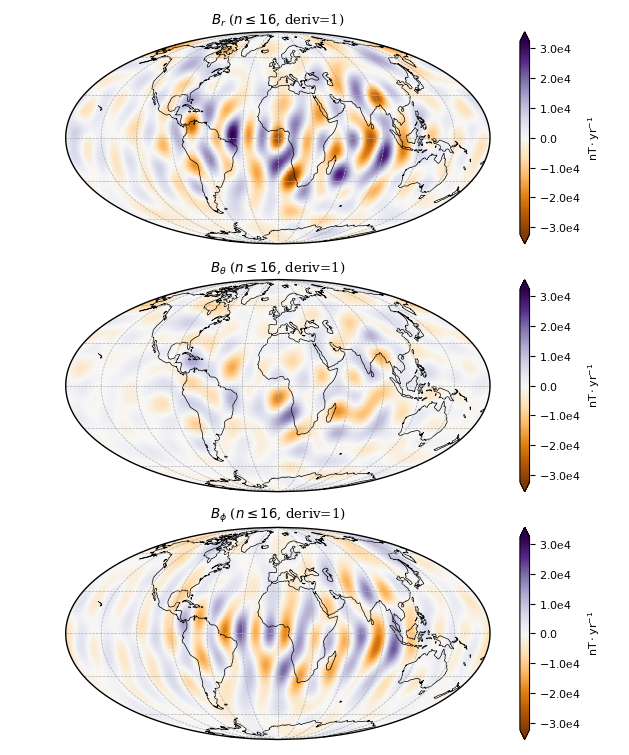
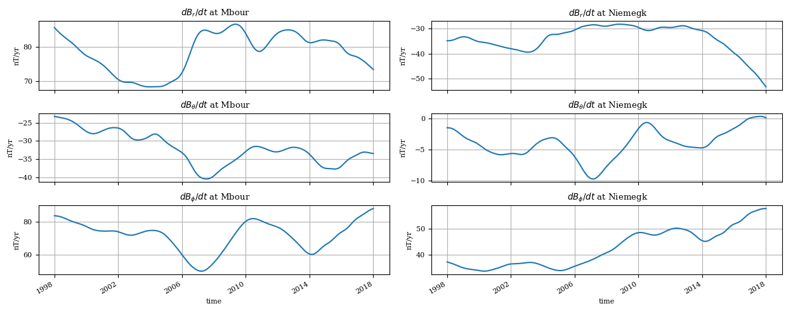

Usage
=====

Here are some simple examples on how to use the package. This only requires a
CHAOS model mat-file, e.g. "CHAOS-6-x7.mat" in the current working directory
which can be downloaded `here <http://www.spacecenter.dk/files/magnetic-models/CHAOS-6/>`_.

Plotting the map of the time-dependent internal field
-----------------------------------------------------

Here, we make a map of the first time-derivative of the time-dependent internal
part of the model. We will plot it on the surface at 3485 km (core-mantle
boundary) from the center of Earth and on January 1, 2000:

.. code-block:: python

   import chaosmagpy as cp

   model = cp.load_CHAOS_matfile('CHAOS-6-x7.mat')

   radius = 3485.0  # km, here core-mantle boundary
   time = 0.0  # mjd2000, here Jan 1, 2000 0:00 UTC

   model.plot_maps_tdep(time, radius, nmax=16, deriv=1)  # plots the SV up to degree 16

   Secular variation at the core-mantle-boundary up to degree 16 in
   January 1, 2000 0:00 UTC.

Save Gauss coefficients of the time-dependent internal (i.e. large-scale core)
field in shc-format to a file:

.. code-block:: python

   model.save_shcfile('CHAOS-6-x7_tdep.shc', model='tdep')

Plotting the map of the static internal field
---------------------------------------------

Similarly, the static internal (i.e. small-scale crustal) part of the model can
be plotted on a map:

.. code-block:: python

   import chaosmagpy as cp

   model = cp.load_CHAOS_matfile('CHAOS-6-x7.mat')
   model.plot_maps_static(radius=6371.2, nmax=85)

.. figure:: images/plot_maps_static.png
  :align: center

  Static internal small-scale field at Earth's surface up to degree 85.

and saved

.. code-block:: python

   model.save_shcfile('CHAOS-6-x7_static.shc', model='static')

Computing field components on a grid
------------------------------------

Instead of plotting the field components, we can just have ChaosMagPy return
the numerical values of the different sources in the model. For
example, the time-dependent internal field:

.. code-block:: python

   import numpy as np
   from chaosmagpy import load_CHAOS_matfile
   from chaosmagpy.model_utils import synth_values
   from chaosmagpy.data_utils import mjd2000

   # create full grid
   radius = 3485.  # km, core-mantle boundary
   theta = np.linspace(0., 180., num=181)  # colatitude in degrees
   phi = np.linspace(-180., 180., num=361)  # longitude in degrees

   phi_grid, theta_grid = np.meshgrid(phi, theta)
   radius_grid = radius*np.ones(phi_grid.shape)

   time = mjd2000(2000, 1, 1)  # modified Julian date

   # load the CHAOS model
   model = load_CHAOS_matfile('CHAOS-6-x7.mat')

   print('Computing core field.')
   coeffs = model.synth_coeffs_tdep(time, nmax=16, deriv=1)  # SV max. degree 16

   B_radius, B_theta, B_phi = synth_values(coeffs, radius_grid, theta_grid, phi_grid)

When using a fully specified regular grid, consider ``grid=True`` option for
speed. It will internally compute a grid similar to :func:`numpy.meshgrid`
without repeating some computations (note the usage of, for example, ``theta``
instead of ``theta_grid``):

.. code-block:: python

   B_radius, B_theta, B_phi = synth_values(coeffs, radius, theta, phi, grid=True)

The same computation can be done with other sources described by the model:

+----------+-----------------+---------------------------------------------------+
|  Source  |     Type        | Method in :class:`~.CHAOS` class                  |
+==========+=================+===================================================+
| internal | time-dependent  | :meth:`~chaos.CHAOS.synth_coeffs_tdep`            |
+          +-----------------+---------------------------------------------------+
|          | static          | :meth:`~chaos.CHAOS.synth_coeffs_static`          |
+----------+-----------------+---------------------------------------------------+
| external | time-dep. (GSM) | :meth:`~.CHAOS.synth_coeffs_gsm`                  |
+          +-----------------+---------------------------------------------------+
|          | time-dep. (SM)  | :meth:`~.CHAOS.synth_coeffs_sm`                   |
+----------+-----------------+---------------------------------------------------+

We can also directly calculate the magnetic field components without having to
synthesize the spherical harmonic coefficients first. Use one of the following
methods:

+----------+-----------------+---------------------------------------------------+
|  Source  |     Type        | Method in :class:`~.CHAOS` class                  |
+==========+=================+===================================================+
| internal | time-dependent  | :meth:`~chaos.CHAOS.synth_values_tdep`            |
+          +-----------------+---------------------------------------------------+
|          | static          | :meth:`~chaos.CHAOS.synth_values_static`          |
+----------+-----------------+---------------------------------------------------+
| external | time-dep. (GSM) | :meth:`~.CHAOS.synth_values_gsm`                  |
+          +-----------------+---------------------------------------------------+
|          | time-dep. (SM)  | :meth:`~.CHAOS.synth_values_sm`                   |
+----------+-----------------+---------------------------------------------------+

Computing the timeseries of field components at two ground observatories
------------------------------------------------------------------------

Compute the timeseries of the first time-derivative of the field components at
the ground observatories in Niemegk (Germany) and Mbour (Senegal).

.. code-block:: python

   from chaosmagpy import load_CHAOS_matfile
   from chaosmagpy.model_utils import synth_values
   from chaosmagpy.data_utils import mjd2000
   from chaosmagpy.plot_utils import plot_timeseries
   import matplotlib.pyplot as plt
   import numpy as np

   model = load_CHAOS_matfile('CHAOS-6-x7.mat')

   N = 500
   time = np.linspace(mjd2000(1998, 1, 1), mjd2000(2018, 1, 1), num=N)
   radius = 6371.2 * np.ones((2,))
   theta = np.array([75.62, 37.93])  # colatitude in degrees
   phi = np.array([343.03, 12.68])  # longitude in degrees

   stations = ['Mbour', 'Niemegk']  # ground observatory names

   # reshape to use NumPy broadcasting
   time = np.reshape(time, (1, N))  # 1 x N
   radius = np.reshape(radius, (2, 1))  # 2 x 1
   theta = np.reshape(theta, (2, 1))  # 2 x 1
   phi = np.reshape(phi, (2, 1))  # 2 x 1

   coeffs = model.synth_coeffs_tdep(time, nmax=16, deriv=1)

   # compute field components of shape 2 x N
   B_radius, B_theta, B_phi = synth_values(coeffs, radius, theta, phi)

   # plot time series of the stations
   for idx, station in enumerate(stations):
       titles = [' $dB_r/dt$ at ' + station,
                 ' $dB_\\theta/dt$ at ' + station,
                 ' $dB_\\phi/dt$ at ' + station]
       plot_timeseries(time, B_radius[idx], B_theta[idx], B_phi[idx],
                       ylabel='nT/yr', titles=titles)
   plt.show()

   Timeseries of the secular variation at two ground observatory stations.

The same procedure can be repeated with any number of stations.
