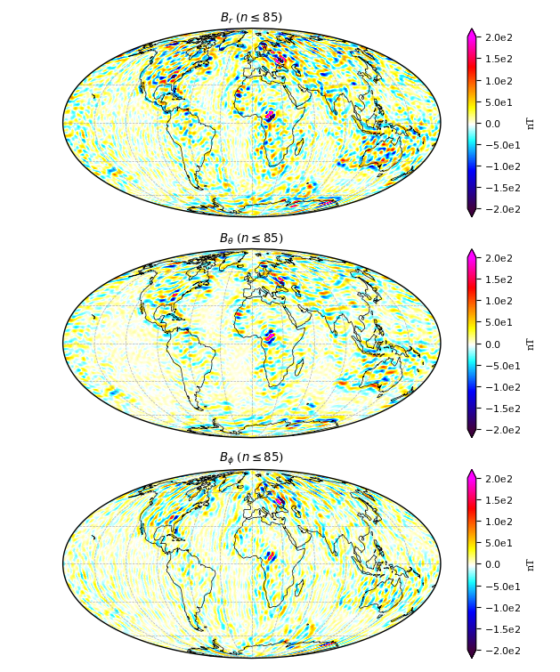

Usage
=====

Here are some simple examples on how to use the package. This only requires a
CHAOS model mat-file, e.g. "CHAOS-6-x7.mat" in the current working directory:

.. code-block:: python

   import chaosmagpy as cp

   model = cp.load_CHAOS_matfile('CHAOS-6-x7.mat')

   radius = 3485.0  # km, here core-mantle boundary
   time = 0.0  # mjd2000, here Jan 1, 2000 0:00 UTC

   model.plot_tdep_map(time, radius, nmax=16, deriv=1)  # plots the SV up to degree 16

.. figure:: images/plot_tdep_map.png
   :align: center

   Secular variation at the core-mantle-boundary up to degree 16 in
   January 1, 2000 0:00 UTC.

Save Gauss coefficients of the time-dependent internal (i.e. large-scale core)
field in shc-format to a file:

.. code-block:: python

   model.write_to_shc('CHAOS-6-x7_tdep.shc', source='tdep')

Similarly, the static internal (i.e. small-scale crustal) field can be plotted
on a map:

.. code-block:: python

   model.plot_static_map(radius=6371.2, nmax=85)

  Static internal small-scale field at Earth's surface up to degree 85.

and saved

.. code-block:: python

   model.write_to_shc('CHAOS-6-x7_static.shc', source='static')
